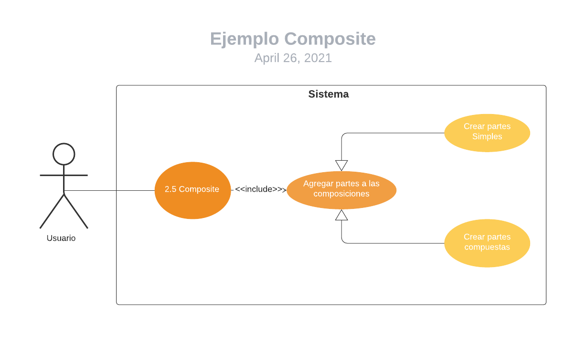
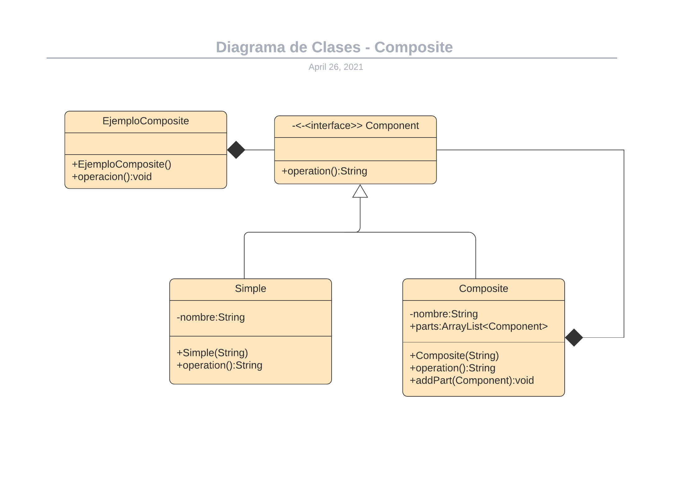

# AnalisisPatrones

_Analisis mediante casos de uso, diagrama de actividades y diagrama de clases de: **Flyweight** y **Composite**._

## Patrones de Diseño ⚙️

### Patrones de creación

Los patrones de creación abstraen la forma en la que se crean los objetos, permitiendo tratar las clases a crear de forma genérica dejando para más tarde la decisión de qué clases crear o cómo crearlas.

- **Abstract Factory:** Proporciona una interfaz para crear familias de objetos o que dependen entre sí, sin especificar sus clases concretas.

- **Builder:** Separa la construcción de un objeto complejo de su representación, de forma que el mismo proceso de construcción pueda crear diferentes representaciones.

## Autores ✒️

_Este trabajo fue realizado por:_

* **Cristian Daniel Meneses Ramírez - 20182020071.** 
* **Daniel Felipe Camargo Roa - 2017202078.**
* **Lorena Damian Cardenas - 2018202060.** 
